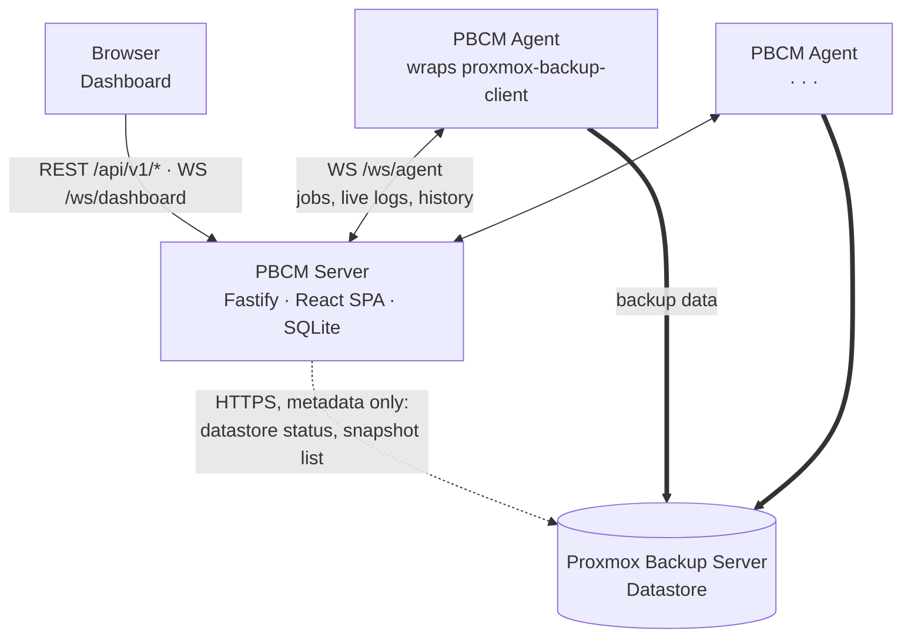
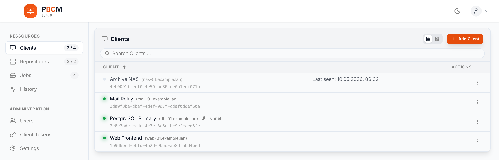
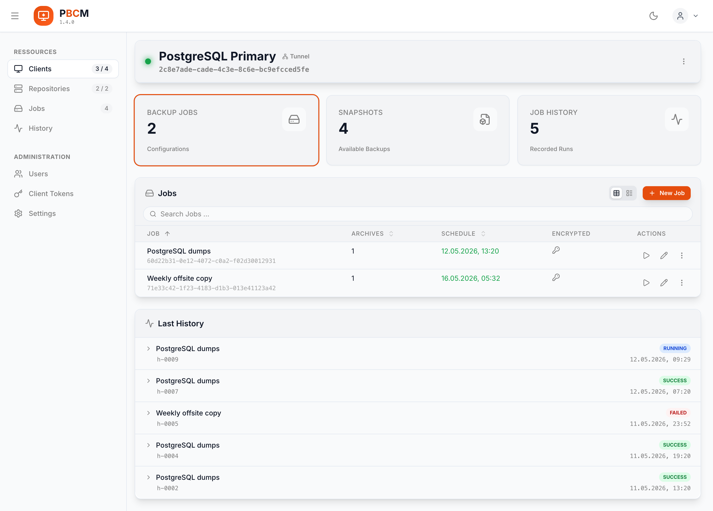
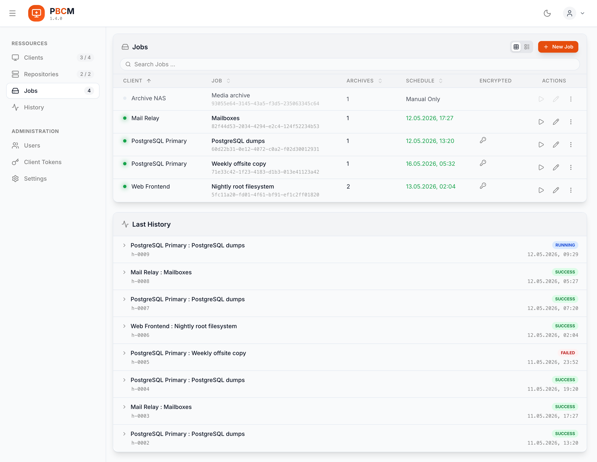
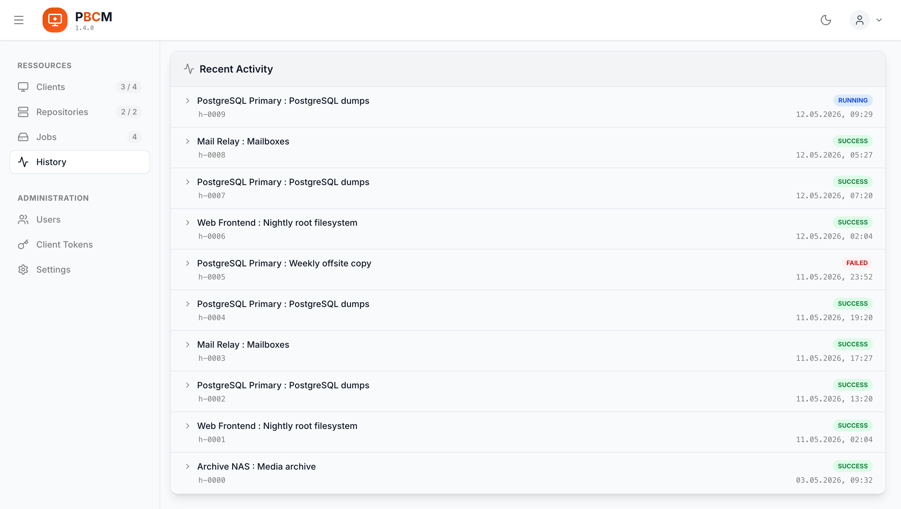
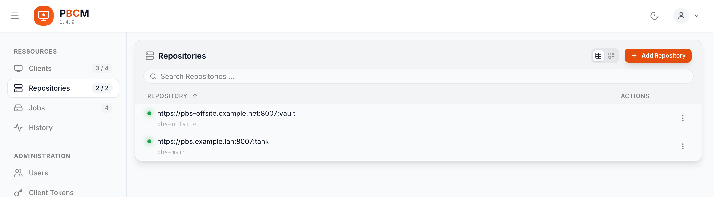

# Proxmox Backup Client Manager (PBCM)

[Proxmox Backup Server](https://www.proxmox.com/en/products/proxmox-backup-server/overview)
(PBS) stores the backups. On every machine you back up, the `proxmox-backup-client`
CLI reads the data, deduplicates and encrypts it, and streams it into a datastore on
that server. PBS manages the *storage* — it does not manage the machines that write
into it. For thirty hosts that means thirty crontabs, thirty copies of the repository
credentials, and no shared answer to "did everything run last night?".

**Proxmox Backup Client Manager (PBCM) fills that gap, and only that gap.** A lightweight Node.js agent runs on each
machine you back up; a central Fastify/React server gives you one dashboard and one
API for all of them. PBCM stores no backup data and replaces no PBS — it is the
control plane above your `proxmox-backup-client` instances.

!!! warning "Unofficial project"

    PBCM is community-driven. It is not affiliated with, endorsed by, or associated
    with Proxmox Server Solutions GmbH. "Proxmox" is a registered trademark of
    Proxmox Server Solutions GmbH.

## How PBCM relates to Proxmox Backup Server

Three parties are involved, and only one of them is a Proxmox product:

| | Who provides it | What it holds | Talks to |
|---|---|---|---|
| **Proxmox Backup Server** | Proxmox Server Solutions GmbH | The backups themselves — deduplicated, encrypted, kept as snapshots in a datastore | accepts connections from the agents and from the PBCM server |
| **PBCM server** | this project | Metadata only: the client list, job definitions, run history and repository credentials, in SQLite | the browser, the agents, the PBS API |
| **PBCM agent** | this project | Its own SQLite copy of the jobs assigned to it — which is what lets it keep working offline | the PBCM server, PBS |



The thick arrows are the point: **backup data never passes through the PBCM server.**
The agent invokes `proxmox-backup-client` locally and the CLI talks to PBS directly,
so throughput and storage are between those two alone — adding PBCM to an existing
setup does not put a new machine in the data path. The PBCM server contacts PBS only
over its HTTPS API, read-only, to show you datastore status and snapshot lists in the
dashboard.

One case bends this, but not as far as it looks: if a client has no route to PBS at
all, the server lends it an [SSH reverse tunnel](tunnel.md). Even then the data does
not travel *through* the PBCM application — it travels through a port forward that
PBCM sets up and tears down around the run.

### Further reading on the Proxmox side

- [Proxmox Backup Server — product overview](https://www.proxmox.com/en/products/proxmox-backup-server/overview)
- [Proxmox Backup Server — administration guide](https://pbs.proxmox.com/docs/)
- [Backup Client Usage](https://pbs.proxmox.com/docs/backup-client.html) — the CLI the
  agent wraps, including the `PBS_REPOSITORY` and `PBS_FINGERPRINT` variables PBCM
  fills in for it

## Life of a backup run

1. You define a job in the dashboard — source paths, schedule, target repository.
2. The server hands it to the agent over `/ws/agent`, and the agent writes it into its
   **own** SQLite database.
3. The agent's cron fires. **The schedule belongs to the agent, not to the server** —
   a PBCM server that is down, restarting or unreachable stops no backup.
4. The agent assembles the `proxmox-backup-client` command, verifies the PBS TLS
   fingerprint (or requests a tunnel lease, if the job asks for one).
5. The CLI streams the data to PBS while its log lines travel over the WebSocket to
   every open dashboard, live.
6. The result goes into the history. If the server was unreachable during the run, the
   agent syncs it up afterwards.

<div class="grid cards" markdown>

-   :material-rocket-launch: **Install it**

    ---

    Docker Compose for the server and for each agent, plus the configuration
    reference and the tunnel setup for clients with no route to the PBS.

    [:octicons-arrow-right-24: Server](install-server.md) ·
    [:octicons-arrow-right-24: Client Agent](install-client.md) ·
    [:octicons-arrow-right-24: Configuration](setup.md) ·
    [:octicons-arrow-right-24: SSH Reverse Tunnel](tunnel.md)

-   :material-sitemap: **Understand it**

    ---

    How the control plane, the dashboard and the agent fit together.

    [:octicons-arrow-right-24: Backend](backend.md) ·
    [:octicons-arrow-right-24: Frontend](frontend.md) ·
    [:octicons-arrow-right-24: Client Agent](client.md)

-   :material-api: **Integrate with it**

    ---

    Every REST endpoint and both WebSocket protocols, request and response shapes
    included.

    [:octicons-arrow-right-24: API Reference](api.md)

-   :material-source-branch: **Contribute to it**

    ---

    Local environment, the Conventional Commits the release is derived from, and the
    build pipeline.

    [:octicons-arrow-right-24: Development Guide](development.md)

</div>

## What it does

- **Centralized management** — view and manage every backup client from one dashboard.
- **Job scheduling & execution** — configure remote backup jobs with cron-like
  schedules, or trigger a backup or restore right now.
- **Global history & sync** — execution history from all clients, collected into one view.
- **Real-time monitoring** — live log streams and status updates over WebSockets.
- **File browser** — browse a client's remote file system for selective backups and restores.
- **Secure communication** — agents authenticate with short-lived registration tokens,
  and every job pins the PBS certificate fingerprint.
- **Reachability** — clients with no route to the PBS back up through an
  [SSH reverse tunnel](tunnel.md), opened per run.
- **Authentication** — local admin accounts and OIDC single sign-on.
- **Daily maintenance** — automatic cleanup of old histories and schedule state.

## The dashboard

<figure>
  <picture>
    <source media="(prefers-color-scheme: dark)" srcset="assets/screenshots/clients-dark.png">
    
  </picture>
  <figcaption>Every managed host in one list. The dot is a live agent connection rather than a stored field &mdash; the sidebar badge counts the same thing.</figcaption>
</figure>

<figure>
  <picture>
    <source media="(prefers-color-scheme: dark)" srcset="assets/screenshots/client-detail-dark.png">
    
  </picture>
  <figcaption>One client: the jobs assigned to it, the snapshots it owns on the PBS, and its own run history.</figcaption>
</figure>

<figure>
  <picture>
    <source media="(prefers-color-scheme: dark)" srcset="assets/screenshots/jobs-dark.png">
    
  </picture>
  <figcaption>Jobs across every client, with the last runs beneath them &mdash; including one still in flight.</figcaption>
</figure>

<figure>
  <picture>
    <source media="(prefers-color-scheme: dark)" srcset="assets/screenshots/history-dark.png">
    
  </picture>
  <figcaption>The global history, collected from every agent &mdash; including runs an agent performed while the server was unreachable.</figcaption>
</figure>

<figure>
  <picture>
    <source media="(prefers-color-scheme: dark)" srcset="assets/screenshots/repositories-dark.png">
    
  </picture>
  <figcaption>The managed PBS repositories. PBCM probes them over the HTTPS API; it stores no backup itself.</figcaption>
</figure>

## The repository

The diagram above is the deployment view. In the source tree, PBCM is an npm monorepo
with four workspaces:

| Workspace | What it is |
|---|---|
| [`server/backend`](backend.md) | Fastify API server — the control plane and the WebSocket hub, holding the SQLite database of configurations and job histories. |
| [`server/frontend`](frontend.md) | React SPA (Vite, Tailwind, Zustand), served by the backend from `server/dist/public`. |
| [`client`](client.md) | Lightweight Node.js daemon wrapping the `proxmox-backup-client` CLI. It keeps its own SQLite copy of the job configs and runs them on schedule **even while the server is unreachable**. |
| `shared` | Single source of truth for the TypeScript types, Zod schemas and constants the other three agree on. |

The central piece on the server side is the `ProxyService`: it owns the live agent
connections, caches job state and fans updates out to every connected dashboard. The
frontend never polls.

## Getting started in one minute

```bash
# Server
docker run -d --name pbcm-server -p 3000:3000 \
    -v ./server-data:/app/server/backend/data \
    -v ./server-config.yaml:/app/server/config.yaml \
    ghcr.io/stefgo/pbcm-server:latest
```

Then open <http://localhost:3000> and log in with `admin` / `admin`. You will need a
reachable Proxmox Backup Server and an API token for it before the first job can run.
The full Compose files are in [Installing the Server](install-server.md) and
[Installing a Client Agent](install-client.md); every configuration key is in
[Configuration](setup.md).
