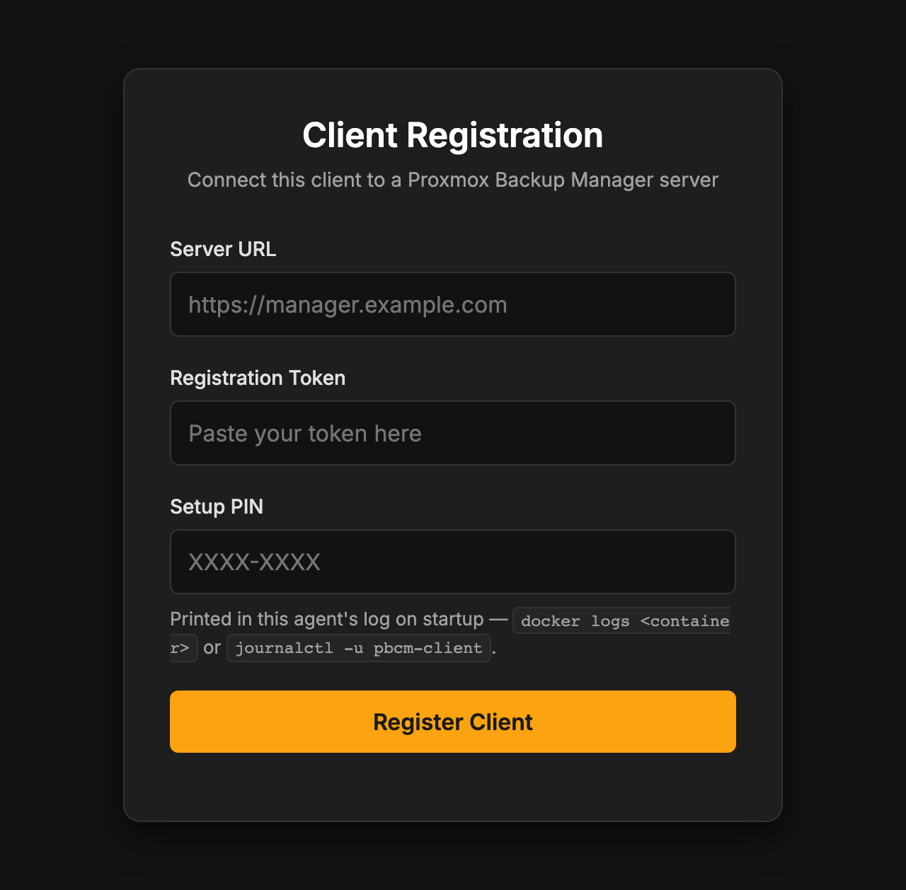
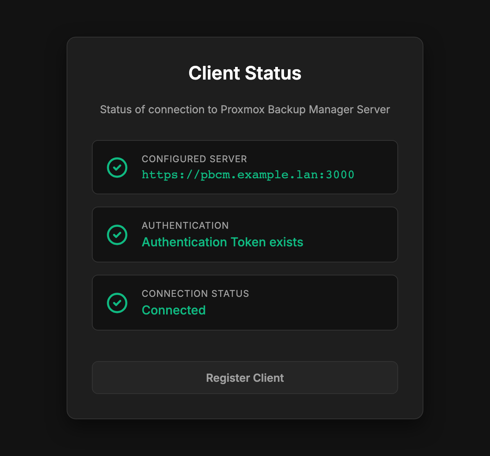

# Installing a Client Agent

The agent runs on every machine you back up. It wraps the `proxmox-backup-client` CLI,
keeps its own SQLite copy of the jobs assigned to it, and runs them on schedule **even
while the PBCM server is unreachable**. This page describes the only supported way to run
it — Docker Compose.

Install the [server](install-server.md) first: the agent needs a server to register with.

## Prerequisites

- **Docker** with the **Compose plugin** on the machine to be backed up.
- **A running PBCM server** you can reach from this machine, and a **registration token**
  from its dashboard (inbound mode) — or the server able to reach *this* machine
  (outbound mode, see below).
- Nothing from Proxmox. **`proxmox-backup-client` is inside the image**, so the host needs
  no Proxmox packages at all. Where it comes from differs by architecture — see
  [Pick the right image](#pick-the-right-image).

## Pick the right image

The agent's two architectures ship as **two image names, not one manifest** — unlike the
server image, `docker pull` will not pick for you:

| Host architecture | Image |
| :---------------- | :---- |
| x86-64 | `ghcr.io/stefgo/pbcm-client:latest` |
| ARM64 (Raspberry Pi, Apple Silicon, ARM servers) | `ghcr.io/stefgo/pbcm-client-arm64:latest` |

`uname -m` answers the question: `x86_64` or `aarch64`. Both names also carry `:main`
(the current state of the main branch, without a release), `:dev` (the state of
development) and a version tag such as `:1.4.0` to pin a release. `latest` is the last
released version and the one to use unless you have a reason not to.

### Where `proxmox-backup-client` comes from

The two images do not get the CLI from the same place, and on ARM64 that is worth knowing
before you deploy:

| | Base | Source of the CLI |
| :-- | :--- | :---------------- |
| `pbcm-client` (amd64) | `debian:bookworm-slim` | The official Proxmox repository `download.proxmox.com/debian/pbs-client`, installed with `apt`. |
| `pbcm-client-arm64` | `debian:trixie-slim` | The community `.deb` from [wofferl/proxmox-backup-arm64](https://github.com/wofferl/proxmox-backup-arm64), pinned to release `4.1.4-1`. |

**Proxmox publishes no ARM64 build of `proxmox-backup-client`.** The
[wofferl/proxmox-backup-arm64](https://github.com/wofferl/proxmox-backup-arm64) project
builds the upstream sources for `arm64` and publishes them as `.deb` packages; the ARM64
image installs one of those. It is what makes an agent on a Raspberry Pi possible at all.

!!! warning "The ARM64 CLI is a third-party build"

    It is neither built nor supported by Proxmox Server Solutions GmbH, and it is not
    covered by whatever support arrangement you have for your PBS. Bugs in the CLI itself
    belong in [that project's issue tracker](https://github.com/wofferl/proxmox-backup-arm64/issues),
    not in PBCM's. The version is pinned in
    [`docker/Dockerfile.client.arm64`](https://github.com/stefgo/proxmox-backup-client-manager/blob/main/docker/Dockerfile.client.arm64)
    and therefore moves only when this project bumps it — it can lag the amd64 image,
    which tracks the Proxmox repository.

!!! warning "Agent and server are updated together"

    They speak one protocol version. An agent older than the server is refused at
    `/ws/agent` with close code `4001`. Keep the two on the same release.

## 1. Create the configuration file

As with the server, the file has to exist before the container starts — a bind mount at a
missing path makes Docker create a directory there.

```bash
mkdir -p pbcm-client && cd pbcm-client
curl -fsSLo client-config.yaml \
    https://raw.githubusercontent.com/stefgo/proxmox-backup-client-manager/main/client/config.example.yaml
```

Leave `clientId` and `authToken` empty. **Both are issued by the server during
registration** and written into this file for you; setting them by hand is how a host ends
up with an identity the server does not know. Every key is documented in
[Configuration](setup.md#client).

## 2. Write the Compose file

```yaml title="compose.yaml"
services:
    pbcm-client:
        container_name: pbcm-client
        # ARM64 hosts: ghcr.io/stefgo/pbcm-client-arm64:latest
        image: ghcr.io/stefgo/pbcm-client:latest
        ports:
            - "3001:3001"
        volumes:
            # Configuration, created in step 1 — the agent writes its identity back here
            - ./client-config.yaml:/app/client/config.yaml
            # SQLite database: the agent's own copy of its jobs, schedules and history
            - client-data:/app/client/data
            # The data to back up. Read-only is enough for backups; see the note below.
            - /:/mnt/host:ro
        environment:
            - NODE_ENV=production
        restart: unless-stopped

volumes:
    client-data:
```

### What the agent can back up is what you mount

This is the one thing containerising an agent changes. The CLI runs **inside** the
container, so a job's source paths are paths in the container's filesystem. Mounting the
host root at `/mnt/host` means the job for `/etc` is configured as `/mnt/host/etc`.

Two consequences worth deciding on deliberately:

- **Mount narrowly if you can.** `- /srv/data:/mnt/data:ro` is a better answer than the
  whole root filesystem when you know what you are backing up. The root mount is the
  convenient default, not the safe one.
- **`:ro` is enough for backups, not for restores.** A restore writes, and it writes to
  the same path it reads from. If this agent should be able to restore in place, drop the
  `:ro` on the paths that need it — and understand that you have given the container write
  access to them.

## 3. Register the agent

Registration is what turns a running container into a client the dashboard knows. Which
path you take was decided when the client was created in the dashboard, and **cannot be
changed afterwards**.

=== "Inbound (the agent dials the server)"

    The normal case. The agent opens the WebSocket to the server, so the server needs no
    route back — this is the mode for agents behind NAT or a firewall.

    1. In the dashboard, **+ Add Client → Inbound**. Give it a display name; optionally
       restrict it to one IP or network. You get a short-lived **registration token**.
    2. Start the container and read the **setup PIN** from its log:

        ```bash
        docker compose up -d
        docker compose logs pbcm-client
        ```

        ```
        ──────────────────────────────────────────────
          Setup PIN:  7K4M-9QX2
          Web UI:     http://<this-host>:3001/register
          The PIN is required to register this agent.
        ──────────────────────────────────────────────
        ```

    3. Open `http://<this-host>:3001/register` and enter the server URL, the registration
       token and the PIN.

    The PIN exists because the caller of that endpoint supplies *both* the server URL and
    the token — without it, anyone able to reach port 3001 could point your unregistered
    agent at a server of their own. It is held in memory only, regenerated on every start,
    rotated after five failed attempts, and stops existing once the agent has an identity.

=== "Outbound (the server dials the agent)"

    For agents that cannot reach the server, or that need the
    [SSH reverse tunnel](tunnel.md) to reach the PBS. The server opens the connection, so
    **this machine must be reachable from the server** on `listenPort`.

    1. Set a one-time secret in `client-config.yaml` and leave `serverUrl` **unset** — the
       agent infers outbound mode from exactly that:

        ```yaml
        registrationSecret: "<a random secret>"
        allowedNetworks:
            - "10.0.0.0/24"     # the network the PBCM server dials from
        ```

    2. Start the container: `docker compose up -d`
    3. In the dashboard, **+ Add Client → Outbound**, with this machine's address and port
       and the same secret. **Create** dials the agent and registers it.

    The secret is removed from the config file once registration succeeds. No setup PIN is
    involved here: the handshake is already guarded by the secret and `allowedNetworks`.

    !!! danger "Outbound plus tunnel needs `network_mode: host`"

        The SSH reverse forward terminates in the network namespace of the **host's**
        sshd. A container on a bridge network has its own `127.0.0.1` and cannot reach it —
        runs fail with `SSH tunnel not reachable … ECONNREFUSED`. Replace the `ports:`
        block with `network_mode: host`; the `ports:` mapping is then ignored, so if 3001
        is taken on the host, set a free one via `PBCM_CLIENT_PORT` and enter that same
        port in the client's target address on the server.

Either way the agent writes the `clientId` and `authToken` it was issued into
`client-config.yaml`, and the client turns online in the dashboard.



*The agent's own registration form on port 3001, used by the inbound path. It stops being served once the agent holds an identity.*



*The same port afterwards. `/status` checks the three things in order and skips the rest after the first failure, so the first red line is the one to fix.*

## 4. Give it a job

Jobs are defined server-side, in the dashboard, and pushed to the agent over the
WebSocket. Remember that the source paths are **container** paths — `/mnt/host/etc`, not
`/etc`, for the mount in step 2.

The schedule then belongs to the agent: its own cron fires it, out of its own database. A
PBCM server that is down, restarting or unreachable stops no backup.

## Operating it

### Health

Both agent images carry a `HEALTHCHECK`, so `docker ps` shows `(healthy)` next to the
container without you adding anything to the Compose file. It calls `GET /api/health` on
the agent's own web UI port (`3001` by default), which needs no login:

```bash
curl -fsS http://localhost:3001/api/health
```

**It reports on the agent, not on the connection to the server.** An agent that cannot
reach the server is still healthy: it keeps its jobs in its own database and runs them on
schedule regardless. Whether it is connected is a different question, answered on the
agent's status page and by `GET /api/status/connection`.

Two consequences worth knowing:

- With `DISABLE_WEB_UI=true` there is no HTTP server at all. The healthcheck knows this
  and reports healthy rather than raising a false alarm — but it then tells you nothing.
- **Docker does not restart an unhealthy container.** `restart: unless-stopped` reacts to
  a process *exiting*, not to its health. An agent that hangs without exiting stays up and
  marked `unhealthy`, which your monitoring can see but Docker will not act on.

### Logs

```bash
docker compose logs -f pbcm-client
```

Live job output also streams to every open dashboard over the WebSocket, so the container
log is mainly for the things that happen before a job does — connection state, the setup
PIN, scheduler decisions.

### Updating

```bash
docker compose pull
docker compose up -d
```

In the same window as the server update. Migrations on the agent's own database run at
startup.

### Re-registering a host

An agent that already holds an identity refuses to register again — `409` on the Web UI
path, close code `4003 Already registered` in outbound mode. That guard is deliberate; to
move a host on purpose:

1. Stop the container.
2. Remove `clientId` and `authToken` from `client-config.yaml` (and set a fresh
   `registrationSecret` for outbound mode).
3. Start it again — a new setup PIN is printed — and register as in step 3.
4. Delete the old client row in the dashboard.

!!! warning "The `clientId` is the PBS `--backup-id`"

    It decides which snapshots the UI groups under this client. A new id starts a new
    snapshot group in PBS and orphans everything backed up so far. Never edit it by hand,
    and re-register only when you mean to.

## Next steps

- [Configuration reference](setup.md#client) — every key in the agent's `config.yaml`.
- [SSH reverse tunnel](tunnel.md) — for a client with no route to the PBS.
- [Client Agent architecture](client.md) — lifecycle, scheduler, executor.
