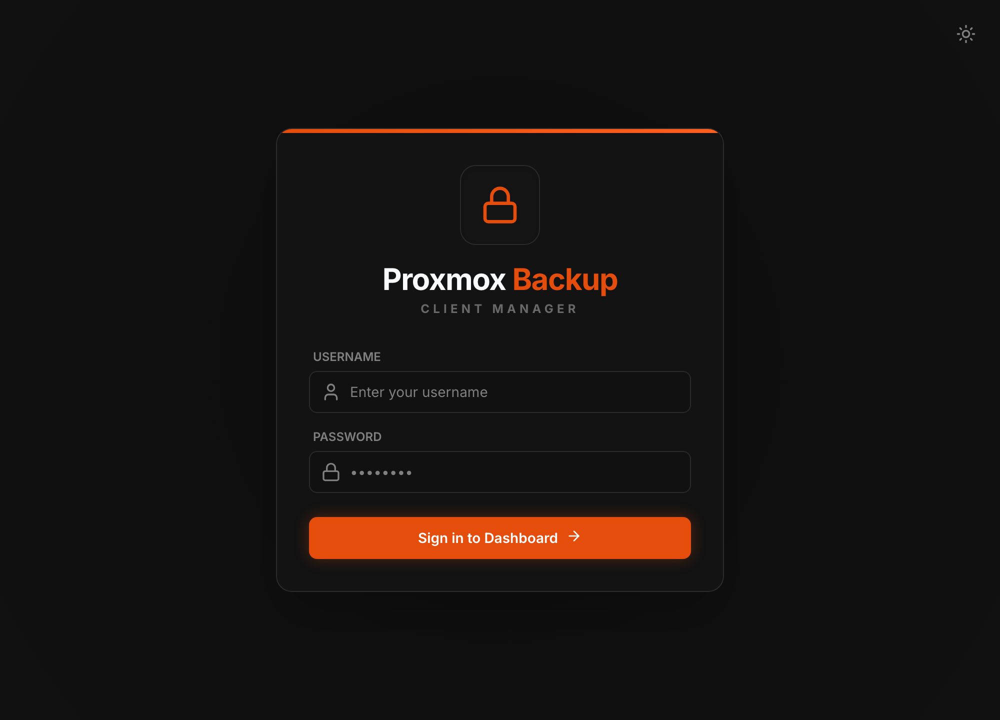

# Installing the Server

The PBCM server is the control plane: the dashboard, the REST API and the WebSocket
hub every agent connects to. It is distributed as a container image and this page
describes the only supported way to run it — Docker Compose.

!!! info "Building from source"

    Everything here uses the published image. Building the image yourself is a
    development concern and needs a GitHub Packages token; see
    [Development & Deployment](development.md#building-locally).

## Prerequisites

- **Docker** with the **Compose plugin** (`docker compose version` ≥ 2). Docker Desktop
  ships both.
- **A reachable Proxmox Backup Server** and an API token for it. PBCM stores no backup
  data of its own — without a PBS to write into, there is nothing for a job to do.
- A host port for the dashboard. The examples use `3000`.

Nothing else. No Node.js, no npm, and no registry token: the image is pulled from GHCR,
which serves it anonymously.

## The image

| Image | Platforms |
| :---- | :-------- |
| `ghcr.io/stefgo/pbcm-server:latest` | `linux/amd64` and `linux/arm64` |
| `ghcr.io/stefgo/pbcm-server:main` | rolling build of the `main` branch — no release |
| `ghcr.io/stefgo/pbcm-server:dev` | rolling build of the `dev` branch — in development |
| `ghcr.io/stefgo/pbcm-server:1.4.0` | a specific release |

Three of these move, and the difference matters:

- **`latest`** is the last released version. It moves only when a release is
  published, which happens deliberately and not on every push. **This is the one
  to use** unless you have a reason not to.
- **`main`** is the current state of the main branch: reviewed and released to
  everyone, but *not* a release. It can be ahead of `latest` and carries no
  version number or changelog entry. Useful to test a fix before it is released.
- **`dev`** is the state of development. Expect it to break.

Pin a version tag if you want upgrades to be a decision rather than a side effect
of `docker compose pull`.

## 1. Create the configuration file

The server writes a `config.yaml` with defaults on first start, but the file has to
**exist** before the container starts — Docker creates a *directory* where a bind mount
points at a missing file, and the server then fails to write its config.

```bash
mkdir -p pbcm && cd pbcm
curl -fsSLo server-config.yaml \
    https://raw.githubusercontent.com/stefgo/proxmox-backup-client-manager/main/server/config.example.yaml
```

An empty file works too (`touch server-config.yaml`); the example is only more readable
afterwards. `jwtSecret` and `tunnel.keySecret` are generated on first start and written
back into it. Every key is documented in [Configuration](setup.md#server).

## 2. Write the Compose file

```yaml title="compose.yaml"
services:
    pbcm-server:
        container_name: pbcm-server
        image: ghcr.io/stefgo/pbcm-server:latest
        ports:
            - "3000:3000"
        volumes:
            # SQLite database: clients, jobs, history, repository credentials
            - server-data:/app/server/backend/data
            # Configuration, created in step 1
            - ./server-config.yaml:/app/server/config.yaml
        environment:
            - NODE_ENV=production
        restart: unless-stopped

volumes:
    server-data:
```

Two things are worth persisting and both are in there. `server-data` holds the SQLite
database — the client list, the job definitions, the run history and the stored PBS
credentials. `server-config.yaml` holds the secrets that sign your sessions and encrypt
the stored SSH keys. **Losing the config file invalidates every session and every stored
tunnel key**; losing the volume loses the installation.

## 3. Start it

```bash
docker compose up -d
docker compose logs -f pbcm-server
```

Open <http://localhost:3000> and log in with `admin` / `admin`.



*The sign-in form. A single sign-on button replaces it when OIDC is configured — see [Configuration](setup.md).*

!!! warning "Change the admin password"

    The default account is created on first start with a known password and the server
    is reachable from wherever you published the port. Change it under **Users** before
    the server sees a network you do not control.

## 4. Connect a Proxmox Backup Server

Under **Repositories**, add the PBS datastore the agents will write into: its host, the
datastore name, an API token (`user@realm!tokenid` plus the secret) and the TLS
fingerprint. The fingerprint is not optional decoration — every job pins it, which is
what makes an agent refuse a substituted server.

With a repository in place, the server can hand out registration tokens and you can
[install the first client](install-client.md).

## Operating it

### Logs

```bash
docker compose logs -f pbcm-server
```

`LOG_LEVEL` and `LOG_FORMAT` change verbosity and shape; see
[Configuration](setup.md#logging). In `production` the default is structured JSON, which
is what you want if the logs go into a collector and not into your terminal.

### Updating

```bash
docker compose pull
docker compose up -d
```

Migrations run automatically at startup — the server applies its umzug migrations to
`server.db` before it accepts connections.

!!! danger "Update agents together with the server"

    Server and agent speak one protocol version. An agent older than the server is
    refused at `/ws/agent` with close code `4001`. Plan the agent updates in the same
    window, and check the [release notes](https://github.com/stefgo/proxmox-backup-client-manager/releases)
    before jumping across a release.

### Backing it up

The two paths from the Compose file are the whole state:

```bash
docker compose stop pbcm-server
docker run --rm -v pbcm_server-data:/data -v "$PWD":/backup debian:bookworm-slim \
    tar czf /backup/pbcm-server-data.tar.gz -C /data .
cp server-config.yaml pbcm-server-config.yaml.bak
docker compose start pbcm-server
```

Stopping first matters: SQLite in WAL mode has state in `-wal` and `-shm` files, and a
tar of a running database can capture a torn moment between them.

### TLS and reverse proxies

The server speaks plain HTTP. Put it behind a terminating reverse proxy (Caddy, nginx,
Traefik) for anything that leaves the host, and make sure the proxy forwards WebSocket
upgrades — the dashboard has no polling fallback, so a proxy that drops `Upgrade`
produces a UI that loads and then never updates.

Once TLS is in front of it you can switch on `security.hsts` in the config.

!!! warning "`hsts` is hard to take back"

    The header tells browsers to refuse `http://` for this host, they remember it for
    months, and turning the header off again does not undo it. On an installation that
    is still on plain HTTP it locks your users out. Only switch it on behind TLS.

### Restricting where agents may connect from

`security.allowed_networks` limits `/ws/agent` to a set of CIDR networks. It is empty by
default, which allows every address. It is one of three related settings that answer
different questions — the comparison is in
[Configuration](setup.md#address-checks-for-agent-connections).

## Next steps

- [Install a client agent](install-client.md) on the first machine you back up.
- [Configuration reference](setup.md) — every key in `config.yaml` and every environment
  variable.
- [SSH reverse tunnel](tunnel.md) — for clients with no route to the PBS.
